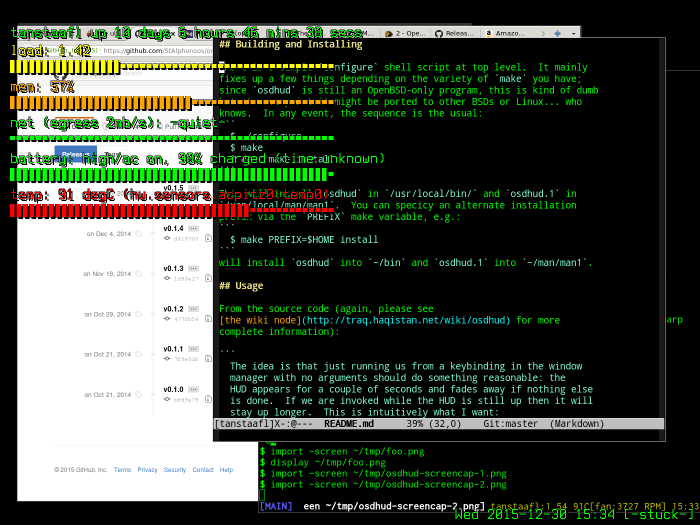

# osdhud - minimalist heads-up display based on xosd

**N.B.**: Please read [the wiki node](http://traq.haqistan.net/wiki/osdhud) for the most up-to-date information including links to source tarballs

`osdhud` is a heads-up display (HUD) for X windows.  It uses the xosd
library to draw its display over everything else and is designed to be
trivial to integrate into whatever desktop environment you use.  That
much said, I use
[cwm](https://en.wikipedia.org/wiki/Cwm_%28window_manager%29) under
[OpenBSD](http://www.openbsd.org) and find it meshes perfectly with
the minimalist desktop: no fixed screen real-estate dedicated to
gauges, widgets or crud.  If you want to know what's going on in your
machine, hit a key.  If you want to know more there's always `xterm -e systat` :-).

At the moment it only works under OpenBSD.  It was originally written
under FreeBSD but has evolved substantially since then (as, I'm sure,
has FreeBSD).  Linux is a totally different kettle of fish and is
unsupported at the moment but should be relatively easy to do if
anyone cares.

## Administrivia

The repository on github are synced more or less as I do things but
the one on [traqistan](http://trac.haqistan.net/browser/osdhud) is
always the most up-to-date.

Please feel free to [contact me](http://trac.haqistan.net/~attila) if
you want to collaborate.

## Building and Installing

There is a simple `configure` shell script at top level.  It mainly
fixes up a few things depending on the variety of `make` you have;
since `osdhud` is still an OpenBSD-only program, this is kind of dumb
but at some point it might be ported to other BSDs or Linux... who
knows.  In any event, the sequence is the usual:
```
  $ ./configure
  $ make
  $ doas make install
```

This will install `osdhud` in `/usr/local/bin/` and `osdhud.1` in
`/usr/local/man/man1`.  You can specicy an alternate installation
prefix via the `PREFIX` make variable, e.g.:
```
  $ make PREFIX=$HOME install
```
will install `osdhud` into `~/bin` and `osdhud.1` into `~/man/man1`.

The `help` target gives a brief usage message for the `Makefile`:
```
$ make help
The following targets are useful:
    help              produce this message
    all               build stuff
    install           install everything but desktop into $(PREFIX)
    clean             clean up temp files
    distclean         clean + reset to virgin state
    dist              cook dist-version.tar.gz tarball
Install prefix: /usr/local (override with PREFIX=... on command-line)
    bin dir:  /usr/local/bin
    man dir:  /usr/local/man
```

## Usage

From the source code (again, please see
[the wiki node](http://traq.haqistan.net/wiki/osdhud) for more
complete information):

```
  The idea is that just running us from a keybinding in the window
  manager with no arguments should do something reasonable: the
  HUD appears for a couple of seconds and fades away if nothing else
  is done.  If we are invoked while the HUD is still up then it will
  stay up longer.  This is intuitively what I want:
      more hit key -> more hud
      stop hit key -> no more hud
  I call this the Caveman Theory of Human/Computer Interaction:
  PUNCH COMPUTER TO MAKE IT GO.
```

The first time osdhud is invoked it will daemonize itself and listen
on a Unix-domain socket; by default it lives in your home directory.
We do this so that osdhud can keep running statistics on things like
network utilization in the background.  Obviously these statistics get
better the longer osdhud runs (although at the moment I don't do too
much of that).  If you want to start osdhud without bringing up the
display use the `-n` option; this can be useful in your `~/.xinitrc`
or similar script if you don't want the HUD to come up for a few
seconds when you start X windows.

More details on the options and usage can be found in the man page; I
keep copies in [pdf](web/osdhud.pdf) and [html](web/osdhud.html)
synced with the source in OpenBSD's wonderful [mandoc](osdhud.mandoc)
semantic markup format for documentation.  I run it through my Perl
`@variable@` expander (`generic/suss.pl`) to get `@VERSION@` expanded
when `osdhud.1` (the final man page) is generated.

## Screenshot

It seems _de rigueur_ to provide a screenshot:



This display was produced by `osdhud -t`, which is why it says
`[-stuck-]` at bottom left.  Without the `-t` the HUD will come up for
a few seconds and count down how long it will be visible at bottom
left instead.

Yeah, my poor little Thinkpad T61 (i386) gets a little hot running
Firefox... s'ok, keeps me honest.
